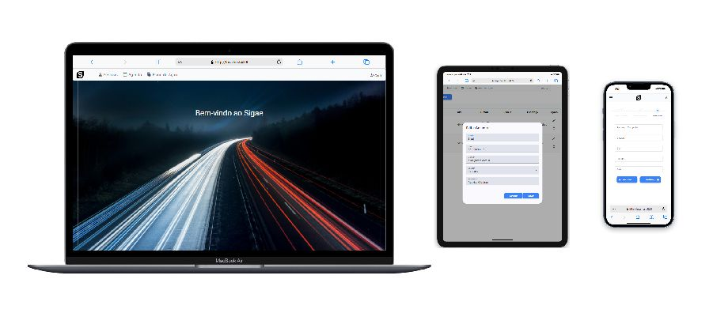

# ⚡ Projeto
## 🚀 Bem-vindo ao projeto Software Sigae Lite! 
### Este é um projeto simples de blog desenvolvido em Angular. 
## Pré-requisitos

Antes de começar, certifique-se de ter o Node.js e o npm instalados em seu ambiente de desenvolvimento.

- Node.js: [Baixar Node.js](https://nodejs.org/)
- npm (gerenciador de pacotes do Node.js): Geralmente instalado junto com o Node.js

## Funcionalidades

- **Persistência de Dados**: Utiliza `LocalStorage` para salvar e persistir dados no navegador.
- **Responsividade**: Projeto otimizado para diferentes tamanhos de tela, proporcionando uma experiência fluida em dispositivos móveis, tablets e desktops.
- **SPA (Single Page Application)**: Aplicação com navegação sem recarregamento de página.
- **Componetização**: Estrutura de componentes reutilizáveis e modulares.

## Instalação

1. Baixe o projeto em arquivo zip para seu ambiente local e
navegue até a pasta do projeto:

   ```bash
   cd siage
      
2. Instale as dependências necessárias do projeto utilizando npm:

   ```bash
   npm install
      
3. Para iniciar o servidor de desenvolvimento do Angular e visualizar o projeto:

   ```bash
   ng serve


